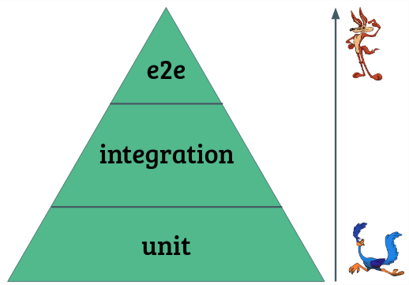
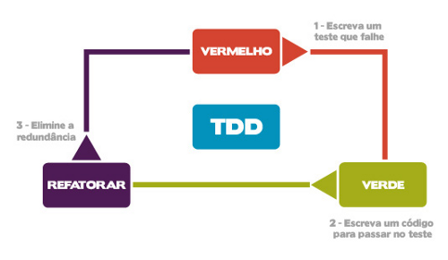
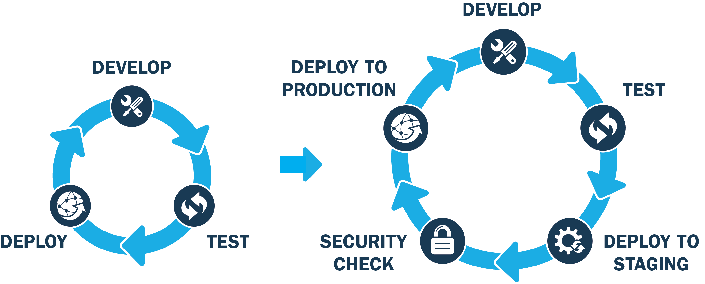

# Anotações sobre testes

## Pirâmide de testes

### e2e (end to end - teste de ponta a ponta)
  - imitar o comportamento do usuário final
  - faz os testes de todo o sistema
  - complexos de escrever
  - demoram um tempo para rodar por conta interações 
  - testa o sistema em um ambiente real

### integration
  - verifica se um conjunto de unidades se comporta da maneira correta
  - a finalidade dele é analisar o comportamento do software quando interage com outras aplicações ou processos
  - testam unidade funcionando em conjunto
  - testam funcionalidade e não o sistama como um todo
  - mais complicado (de fazer e manter) e demorados que os testes de unidade
  - bem mais simples (de fazer e manter) e rapidos que os testes de ponta a ponta
  - mais lentos que os testes de unidades, pois eles testam funcionalidade inteiras
  - São passiveis de "Flaky Test" (teste com falso negativo no caso de automação)
  - Geralmente esses testes são feito em requisições HTTP (igual os testes de backend)
  - também usam dublês para dependencias externas (mocks)

### unit (teste de unidade)
  - verificar o funcionamento da menor unidade de código testável da nossa aplicação
  - são independentes de colaboradores externos (mock)
  - pode guiar o design do seu código
  - rodam muito rapido e são simples (de fazer e manter)
  - pode ser uma classe ou função

### teste usabilidade
  - avalia a qualidade do software no quesito experiência do usuário
  - a veerificação cobre também a performance do programa ao executar uma determinada ação
  - permite, também, verificar o comportamento da plataforma em diferentes dispositivos

### teste funcional
  - atestar se a aplicação é capaz de desempenhar as funções que se propõe a fazer
  - pode ser tanto manualmente quanto automaticamente
  - caixa-braca:
    - quem testa conhece o código
    - foco na análise do comportamento interno do software
    - analisa qual caminho ocorre o fluxo de dados
    - é possivel verificar se há a passagem correta em todas as condições esperadas
    - precisamos tomar cuidado para não criar testes enviesados
  - caixa-preta: 
    - feito em cima das funções que devem ser empenhadas pelo programa
    - a pessoa não tem acesso ao código fonte e nem a sua estrutura

### teste de performance (teste não funcional)
  - uma série de análises voltadas para o desempenho do software mediante várias situações
  - testa se os comando dados respondem rapidamente
  - testa se os componente não demorar muito a carregar
  - testa se a experiencia do usuário é satisfatória no produto testado

### teste de carga (teste não funcional)
  - simula várias pessoas usuárias acessando seu sistema em simultâneo para ver como ele se comporta
### teste de estresse (teste não funcional)
  - coloca o sistema em situações extremas de acessos e tráfego de dados para saber como ela vai se comportar e quais pontos de falhas podem acontecer

### teste de estabilidade
  - testa se o software não perde performance depois de determinado tempo de uso

### teste de regressão
  - para evitar a recorrência de um erro
  - testa se uma nova feature não quebra o sistema

### teste de segurança (teste não funcional)
  - testa se o produto final só é entregue ao cliente quando os requisito de segurança são devidamente preenchidos
  - verifica a segurança do software no que diz respeito à proteção de ataques e virus

### teste de instalação
  - verifica se sob diferentes condições se o programa consegue ser instalado ou se cede facilmente a essas limitações

### teste de manutenção
  - averiguam se aprimoramentos acontecem com sucesso e se são aceito pelo sistema

### teste de aceite
  - geralmente se concentra no comportamento e na capacidade de todo um sistema ou produto
  - verifica se todo o projeto funciona de acordo com sua especificação
  - visam aferir se algo na interface faça o sistema não funcionar ou que dificulte o acesso ao usuário
  - teste de aceite do usuário (UAT):
    - colocar o sistema em um ambiente controlado para que o usuário da aplicação faça um "TestDrive"
  - teste de aceite operacional (OAT)
    - é focado na equipe de administração do sistema
    - realizado em um ambiente controlado
    - podem incluir testes como backup e restauração, instalação, recuperação de desastres, gerenciamento de usuário, tarefas de manutenção, vulnerabilidade, segurança e teste de performance 
  - teste de aceite contratual e regulatório
    - O teste de aceite contratual é realizado com base nos critérios de aceite de um contrato para desenvolver softwares específicos.

### Alfa e Beta teste
  - Alfa: realizado de uma forma não planejada, disponibilizando o sistema dentro da infraestrutura da emprea que sedenvolveu o produto e para um pequeno grupo de pessoas que geralmente são membros da organização e também o cliente
  - Beta: é realizado de uma forma não planejada e executa por um grande número de pessoas desconhecidas. O sistema é executa na infraestrutura dessas pessoas que não possuem nenhuma relação com a equipe ou empresa desenvolvedora

### teste de sanidade (smoke test)
  - Serve para dizer somente se sua aplicação está respondendo corretamente ou não
  - testa se as principais funcionalidades estão funcionando

### teste de mesa
  - teste feito na mão (papel e caneta)

## Beneficios de escrever testes
  - Evitar o trabalho repetitivo
  - Ter um feedback mais rápido
  - Economizar tempo
  
## TDD (Test Driven Development)

  - o desenvolvedor escreve o teste antes de escrever o codigo funcional necessário para satisfazer aquele teste

### o que ganho com TDD?
  - Reduz o tempo gasto em depuração e correção de bugs
  - não é desenvolvido código desnecessário
  - auxilia testes de regressão
  - melhora a qualidade do código
  - documentação pelos testes
  - refatoração constante

## Integração contínua
  - consiste em rodar os testes automatizado e realizar a publicação da aplicação para o ambiente de produção de forma automática a cada push para o repositório
  

